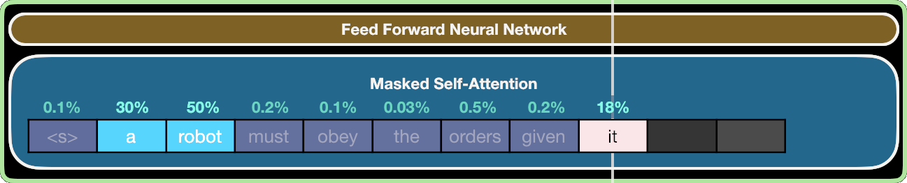

# LLM Surprisal ~ Human Reading Time

<!-- _footer: Tobias Hoffmann, Lars Konieczny, Henrik Lorenzen, Mateo Cortés Lafourcade -->

# Large Language Models

- Task: Given words so far, predict next word
  - e.g. prompt: "*The cat eats the* ", prediction: "*mouse*"
- State of the art: Attention mechanism
  - Idea: Mix in *relevant* context tokens
  - Include large context without forgetfulness 

  </img>

# LLM Surprisal

- Normally: Most likely next word?
- Instead: How likely is *this* next word?
  - I.e. $P(t_n | t_{n-1}, ..., {t_0})$
- *Surprisal* $:=$ $-log_2P(t_n | t_{n-1}, ..., {t_0})$
  - High surprisal $\Leftrightarrow$ Low probability
  - Between $0$ and $\infty$

<pre>
The cat eats the  <b>mouse.</b>
-   8.8 7.2  1.7  <b>4.1</b>
 The cat eats the  <b>car.</b>
-   8.8 7.2  1.7  <b>15.1</b>

</pre>

# Human Reading Time

- How much time is spent per word while reading?
- Different metrics: *First Pass*, *Go Past*, etc.
- Generally: Predictable word ~ short reading time
  - I.e. we "read over" words that are predictable
- Measured in differ

**TODO: IMAGE**

# Surprisal ~ Reading Time ?

- Dataset: German sentences & short texts
- GPT-3+ Surprisals via OpenAI API
- Reading times via eye tracking
- Yes!

**TODO**

# Local Syntactic Coherences

The coach chided the <u>player tossed the frisbee by the opposing team</u>.
The coach chided <u>the player tossed the frisbee</u> ***by*** the opposing team.

**TODO:** BETTER EXAMPLE SENTENCE

- Conflict between local and global parsing
- Increased reading time at subsequent word
- Not just syntactical
  - Influenced by context (including visual & textual)

# Context influences LSC-Effect

**TODO: Leave this out?**

Mit **(langweiligen Anekdoten | spannenden Geschichten)** überzieht der erste Redner sein Zeitlimit. Das Publikum hört ihm dabei **(gähnend | gespannt)** zu. Nach dem dreistündigen Vortrag hat er keine Energie mehr und übergibt an den nächsten Redner.

<i></i>

The first speaker exceeds his time limit with **(boring anecdotes | exciting stories)**. The audience listens to him **(yawning | attentively)**. After the three-hour talk, he has no more energy, and hands over to the next speaker.

Der nächste Redner ärgert sich über alle Maßen, als ihm der erste Redner **müde** das Publikum überlässt.

OR

Der nächste Redner ärgert sich über alle Maßen, als ihm <u>der erste Redner **ermüdet** das Publikum</u> ***überlässt***.

The next speaker is annoyed beyond measure, as the first speaker **(tiredly | tires)** leaves the audience to him.

# LSC-Effect in NNs?

- In RNNs: Yes
- In Transformers: No ✨
  - Explanation (?): Attention mechanism has no intrinisic local preference

# Conclusion

**TODO: SOURCES**

- LLM Surprisal predicts human reading times
- But LLMs aren't fooled by local syntactic coherences
- 💡 LLM Surprisal as quantitative research tool
- ⚠️ Limits of LLMs as models of human language processing

- **AMLAP Poster:** http://dx.doi.org/10.13140/RG.2.2.15402.39363/2
- **Slides at:** https://github.com/Garbaz/IICCSSS2023
